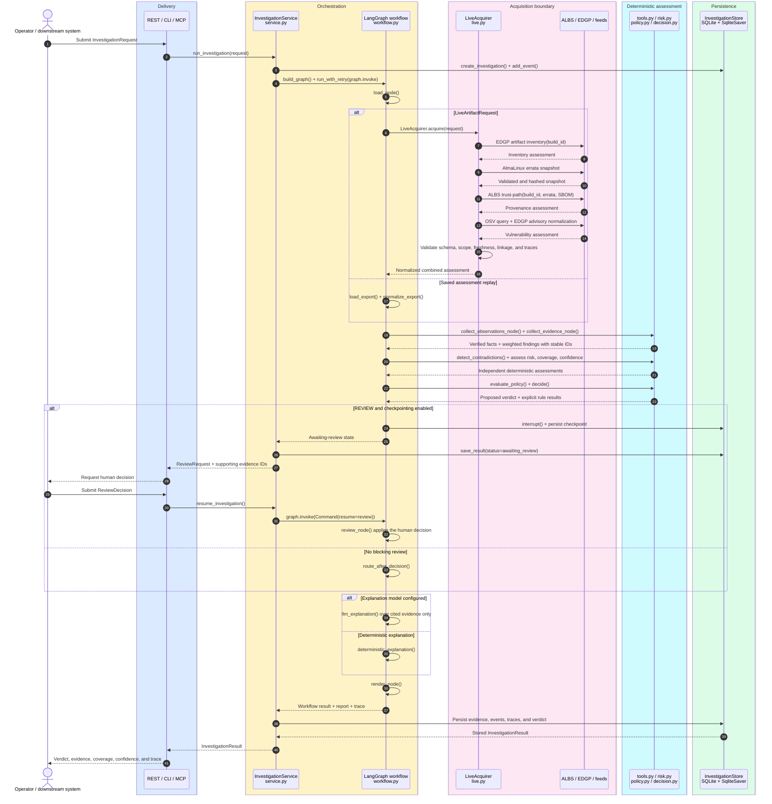

# Enterprise Linux Provenance Risk Agent

[](https://github.com/xsub/ProvenanceRiskAgent/actions/workflows/ci.yml)
[](https://htmlpreview.github.io/?https://github.com/xsub/ProvenanceRiskAgent/blob/main/docs/presentation/index-en.html)
[](https://htmlpreview.github.io/?https://github.com/xsub/ProvenanceRiskAgent/blob/main/docs/presentation/index.html)

**An evidence-first control plane for Enterprise Linux software supply-chain
investigations.**

The agent orchestrates ALBS Provenance Explorer and Enterprise Dependency Graph
Pipeline (EDGP), which acquire artifacts and produce deterministic domain
assessments. It validates and reconciles those assessments with AlmaLinux errata
and OSV advisory context, then produces a traceable risk verdict. Given an ALBS
build ID or saved export, it returns verified facts, weighted findings,
coverage, confidence, a proposed decision, and the complete execution trace.
Acquisition is bounded and traceable; normalization, scoring, policy, and the
proposed decision are deterministic for the acquired inputs. An LLM is
optional and limited to grounded explanation.

**Status:** runnable local MVP with live acquisition, saved-input replay, web,
REST, CLI, and MCP interfaces. The current implementation is single-service and
SQLite-backed; its production boundaries are documented below.

## Vision, Scope, and Goal

ALBS Provenance Explorer and EDGP expose substantial deterministic capability,
but using them together requires an operator to select commands, manage many
parameters, reconcile artifact identities, join outputs, and map evidence to
policy. At that point, the human has effectively become the orchestration
agent.

This project makes that role explicit and programmable. It behaves less like a
chatbot and more like a specialized software supply-chain security officer: it
investigates an artifact, checks evidence, applies a versioned rulebook,
identifies missing or contradictory facts, and produces a verdict with source
pointers. A human or downstream system remains responsible for accepting,
reviewing, or rejecting that verdict.

The goal is narrow by design: provide a faster and safer interface over ALBS
and EDGP for answering three questions:

1. Why is this artifact risky?
2. Which evidence supports that conclusion?
3. Is the evidence complete and consistent enough to trust the verdict?

The agent does not replace provenance engines, vulnerability feeds, or
organizational authorization. It turns their outputs into one inspectable
decision process.

## Design Principles

- **Evidence before inference.** Every material finding has a stable evidence
  ID and source pointer.
- **Deterministic authority.** Code owns facts, risk, completeness, confidence,
  policy, contradictions, and the proposed machine decision.
- **Explicit uncertainty.** Missing, stale, truncated, contradictory, or
  unavailable evidence is never translated into a clean result.
- **One workflow, multiple surfaces.** Web, REST, CLI, and MCP use the same
  LangGraph investigation graph.
- **Governed policy.** Risk weights and decision thresholds live in immutable,
  versioned profiles and are checked against an executable calibration suite.
- **Optional LLM.** A model may explain an existing result; it cannot invent or
  modify evidence or the verdict.

## Quick Start

Start the containerized application:

```bash
docker compose up --build
```

Open [http://localhost:8080](http://localhost:8080) for the investigation UI or
[http://localhost:8080/docs](http://localhost:8080/docs) for the OpenAPI
contract. The curated `Albs Edgp Risk Case` works offline and demonstrates a
combined ALBS/EDGP verdict.

Run the same deterministic workflow from the CLI:

```bash
python -m venv .venv
. .venv/bin/activate
pip install -e '.[dev]'
provenance-agent analyze examples/albs-edgp-risk-case.json
```

Run a live investigation:

```bash
pip install -e '.[live]'
provenance-agent analyze-live 57810 \
  --package nginx-core \
  --arch x86_64 \
  --ecosystem AlmaLinux:10 \
  --sbom /path/to/build-57810.cyclonedx.json \
  --policy-profile enterprise-linux-default@1.0.0
```

Omitting `--sbom` is allowed, but the missing coverage remains visible in the
result. Advisory failures are retried within a bounded budget and reported as
incomplete coverage, never as zero vulnerabilities. Failure of a required
ALBS or EDGP acquisition ends the investigation as `ERROR` after bounded retry.

## Architecture

```mermaid
flowchart TB
  subgraph interfaces["Interfaces"]
    ui["Web UI"]:::interface
    rest["REST API"]:::interface
    cli["CLI"]:::interface
    mcp["MCP"]:::interface
  end

  subgraph control["Agent control plane"]
    graph["LangGraph investigation workflow"]:::control
    state["SQLite events and checkpoints<br/>interrupt / resume"]:::control
    adapters["Bounded process and HTTP adapters"]:::control
  end

  subgraph sources["Assessment engines and inputs"]
    albs["ALBS Provenance Explorer<br/>acquisition + provenance assessment"]:::source
    edgp["EDGP<br/>acquisition + graph assessment"]:::source
    feeds["AlmaLinux errata + OSV<br/>advisory and CVE context"]:::source
    exports["Saved exports<br/>deterministic replay"]:::source
  end

  subgraph decision["Deterministic decision path"]
    normalize["Normalize evidence<br/>stable IDs and source pointers"]:::evidence
    verify["Check completeness<br/>freshness and contradictions"]:::policy
    profiles["Versioned policy profile<br/>weights and thresholds"]:::policy
    verdict["Risk + confidence + verdict"]:::result
    review["Human review when required"]:::review
    explain["Grounded explanation<br/>LLM optional"]:::explain
  end

  ui --> graph
  rest --> graph
  cli --> graph
  mcp --> graph
  graph <--> state
  graph --> adapters
  adapters --> albs
  adapters --> edgp
  adapters --> feeds
  graph --> exports
  albs --> normalize
  edgp --> normalize
  feeds --> normalize
  exports --> normalize
  normalize --> verify
  profiles --> verdict
  verify --> verdict
  verdict --> review
  verdict --> explain
  review --> explain

  classDef interface fill:#dbeafe,stroke:#2563eb,color:#0f172a,stroke-width:2px;
  classDef control fill:#fef3c7,stroke:#d97706,color:#422006,stroke-width:2px;
  classDef source fill:#fce7f3,stroke:#db2777,color:#500724,stroke-width:2px;
  classDef evidence fill:#ede9fe,stroke:#7c3aed,color:#2e1065,stroke-width:2px;
  classDef policy fill:#cffafe,stroke:#0891b2,color:#164e63,stroke-width:2px;
  classDef result fill:#dcfce7,stroke:#16a34a,color:#052e16,stroke-width:2px;
  classDef review fill:#fee2e2,stroke:#dc2626,color:#450a0a,stroke-width:2px;
  classDef explain fill:#fae8ff,stroke:#c026d3,color:#581c87,stroke-width:2px;

  style interfaces fill:#0b1220,stroke:#60a5fa,color:#dbeafe;
  style control fill:#1c1917,stroke:#f59e0b,color:#fef3c7;
  style sources fill:#1f1020,stroke:#f472b6,color:#fce7f3;
  style decision fill:#111827,stroke:#22d3ee,color:#cffafe;
```

LangGraph owns bounded orchestration and review routing. ALBS and EDGP remain
responsible for acquiring domain artifacts and producing their expert
assessments. The agent validates, normalizes, and reconciles those assessments;
the policy layer acts as a rulebook over the resulting evidence, not as a
substitute for it.

### Implementation-Aware Runtime Sequence

This view connects the architectural flow to the modules and methods that
implement it. It follows one investigation across all delivery surfaces; saved
replay bypasses the live acquisition branch but enters the same deterministic
workflow.



## Decision Model

The report keeps four concepts separate:

| Output | Meaning |
| --- | --- |
| Risk | Weighted severity of evidence-backed findings. |
| Completeness | Required evidence categories that were actually checked. |
| Confidence | Reliability of the verdict given coverage and contradictions. |
| Decision | `ALLOW`, `DENY`, `REVIEW`, `UNKNOWN`, or `ERROR`. |

With the built-in profiles, deterministic analysis proposes `ALLOW`, `REVIEW`,
or `UNKNOWN`. `ERROR` represents an operational failure, while `DENY` is
currently available as an explicit human-review outcome rather than an
automatic model or score decision.

This separation is load-bearing. `risk=0` does not imply safety when evidence is
missing. `ALLOW` requires zero risk, no contradictions, complete required
coverage, and sufficient confidence. A source timeout lowers coverage; it does
not produce a clean vulnerability result.

Human review uses LangGraph `interrupt()` with a SQLite checkpointer. Resuming
the workflow records the reviewer decision while preserving the original
deterministic proposal.

## Live Evidence Pipeline

A live request follows a controlled sequence:

1. EDGP resolves the build inventory and the target AlmaLinux ecosystem.
2. The inventory is scoped to the exact package, version-release, and
   architecture selected by ALBS.
3. The AlmaLinux errata snapshot is fetched, structurally validated, hashed,
   and passed to ALBS as the same validated temporary file.
4. ALBS builds the trust path and proves CycloneDX linkage through a
   `described_by` edge.
5. OSV is queried for the exact package and version; EDGP normalizes the
   returned advisory records.
6. The selected policy profile assigns weights, checks coverage, and emits a
   verdict with acquisition traces and response hashes.

| Producer or input | Role | Trust control |
| --- | --- | --- |
| ALBS Provenance Explorer | Acquires build artifacts and assesses lineage, CAS, signatures, release, SBOM and errata association | Pinned revision, typed schema, bounded subprocess |
| EDGP | Acquires graph inputs and assesses inventory, dependencies, impact and advisories | Pinned revision, narrow library bridge, exact artifact scoping |
| [AlmaLinux errata](https://wiki.almalinux.org/documentation/errata.html) | Distribution advisory snapshot | HTTPS, structural validation, SHA-256 trace |
| [OSV API](https://google.github.io/osv.dev/api/) | Exact package/version vulnerability query | HTTPS, freshness and truncation checks |

The Docker image pins the source engines to immutable Git revisions:

- ALBS Provenance Explorer: `9d33703ae923e03f3c77bd0d27a3c58ae37d638f`
- EDGP: `4ca0b0042bfe7b91b45b27f0af6054b3847afef6`

Official source hosts are allowlisted by default. Controlled deployments can
add private mirrors through the comma-separated
`PROVENANCE_AGENT_ALLOWED_LIVE_HOSTS` environment variable.

## Policy Profiles

Two built-in profiles demonstrate explicit policy governance:

| Profile | Intended use |
| --- | --- |
| `enterprise-linux-default@1.0.0` | Preserves the validated MVP baseline. |
| `enterprise-linux-strict@1.0.0` | Raises weights and review sensitivity for release gates. |

Inspect and compare them with:

```bash
provenance-agent policy-profiles
provenance-agent calibrate-policy
```

Calibration currently proves deterministic baseline compatibility and
strict-profile monotonicity on the golden dataset. It is a governance check,
not statistical calibration against production labels.

## Interfaces

| Surface | Entry point |
| --- | --- |
| Web UI | `http://localhost:8080` |
| OpenAPI / REST | `http://localhost:8080/docs` |
| Saved analysis | `provenance-agent analyze INPUT.json` |
| Live analysis | `provenance-agent analyze-live BUILD_ID ...` |
| MCP over stdio | `provenance-agent mcp` |
| MCP over HTTP or SSE | `provenance-agent mcp --transport streamable-http` or `--transport sse` |

Full evaluation entry points return the same core artifacts: verified facts,
weighted risk evidence, evidence IDs, source pointers, contradictions, policy
results, completeness, confidence, decision state, and execution trace.

Saved replay supports these source contracts:

- `albs-provenance-explorer/v1`
- `edgp.rpm.albs_provenance.v1`
- `edgp.albs.artifact_inventory.v1`
- `edgp.graph.snapshot.v1`
- `edgp.public.advisory_feed.v1`

The compact fixture format under `examples/` remains available for learning
and deterministic tests; it is not the preferred production input.

### Optional LLM Explanation

```bash
pip install -e '.[openai]'
export OPENAI_API_KEY=...
provenance-agent analyze examples/suspicious-build.json \
  --model openai:gpt-4.1-mini
```

The model is selected at runtime. The workflow does not depend on one provider,
and the model cannot change deterministic outputs.

## Verification

Run the local quality gates:

```bash
pip install -e '.[dev]'
ruff check .
pytest -q
provenance-agent evaluate-golden
provenance-agent calibrate-policy
```

Verified baseline on 2026-07-22:

- Ruff passed.
- Pytest passed: **50 tests**.
- Golden evaluation passed: **10/10 scenarios**.
- Default-versus-strict policy calibration passed.
- GitHub Actions passed on Python 3.11, 3.12, and 3.13.
- The Docker image passed dependency, readiness, CLI, and responsive UI checks.

A containerized live run for ALBS build `57810` and
`nginx-core-1.26.3-6.el10_2.3.x86_64` completed through all seven acquisition
stages:

| Result | Value |
| --- | --- |
| Decision | `REVIEW` |
| Risk | `24/100` (`low`) |
| Completeness | `100/100` |
| Confidence | `100/100` |
| Advisory evidence | 3 unique OSV records |
| Contradictions | 0 |
| SBOM | 457 CycloneDX components, linked to the selected artifact |

The result is intentionally `REVIEW` despite complete evidence: completeness
describes the investigation, not the safety of the artifact.

## Production Boundaries

The current system is a complete local MVP, not yet a multi-tenant production
service. Its deliberate constraints are:

- single-process execution and SQLite persistence;
- bounded in-process retry rather than process-surviving job recovery;
- HTTPS and response hashes rather than signed feed snapshots or transparency
  proofs;
- deterministic fixture calibration rather than reviewed production labels;
- no production telemetry or service-level objectives yet.
- a fixed evidence plan: the question is recorded for traceability, but it does
  not yet drive dynamic intent parsing or tool selection.

Redis, RabbitMQ, and Celery are not required for this stage. RabbitMQ/Celery
become justified when retries must survive process termination or work must be
distributed across workers. Redis may support caching, progress delivery,
short-lived locks, or rate limits. Neither should become the source of truth
for evidence or verdicts.

Next engineering milestones:

1. Governed, versioned ALBS/EDGP evaluation snapshots with reviewed labels and
   explicit false-positive/false-negative costs.
2. Signed advisory snapshots or transparency verification.
3. PostgreSQL when concurrent multi-user workloads require it.
4. OpenTelemetry traces, operational metrics, and service-level objectives.
5. Durable workers only after measured queueing or recovery requirements.

## Project Documentation

- [Project goals](ProjectGoals.md)
- [Learning process](learning-process.md)
- [Validation harness](harness.md)
- [Architecture decisions](docs/adr/)
- [Initial planning baseline](docs/planning/initial-demonstrator-plan.md)
- [English presentation](https://htmlpreview.github.io/?https://github.com/xsub/ProvenanceRiskAgent/blob/main/docs/presentation/index-en.html)
- [Polish presentation](https://htmlpreview.github.io/?https://github.com/xsub/ProvenanceRiskAgent/blob/main/docs/presentation/index.html)
