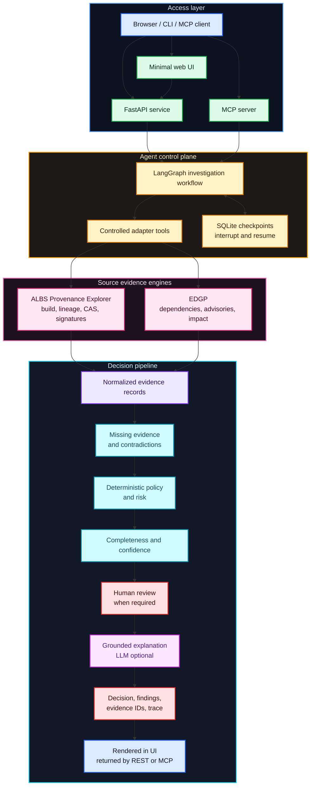
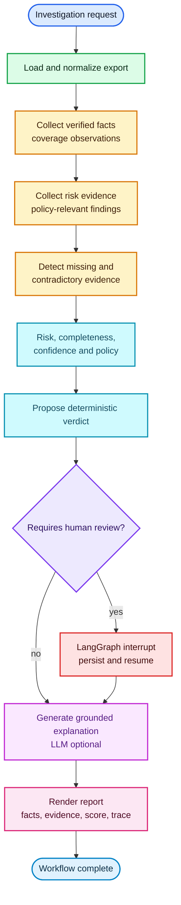

# Enterprise Linux Provenance Risk Agent

[](https://github.com/xsub/ProvenanceRiskAgent/actions/workflows/ci.yml)
[](https://htmlpreview.github.io/?https://github.com/xsub/ProvenanceRiskAgent/blob/main/docs/presentation/index-en.html)
[](https://htmlpreview.github.io/?https://github.com/xsub/ProvenanceRiskAgent/blob/main/docs/presentation/index.html)

Enterprise Linux Provenance Risk Agent is a container-first agentic application
for explainable Enterprise Linux artifact risk analysis.

The project has evolved from a compact LangChain/LangGraph learning harness
into a runnable local application with a web UI, REST API, MCP interface, typed
evidence contracts, deterministic policy evaluation, and grounded explanations.

The agent consumes evidence from ALBS Provenance Explorer and Enterprise
Dependency Graph Pipeline (EDGP), gathers deterministic provenance and graph
evidence, calculates deterministic risk and policy outputs, and uses an LLM
only for optional explanation. The LLM never invents or modifies package facts,
evidence records, risk scores, completeness, confidence, or decisions.

## Vision, Scope, and Goal

The project vision is straightforward: Enterprise Linux supply-chain tools
should expose an interface that matches how quickly modern investigations have
to move.
ALBS Provenance Explorer and EDGP already provide strong deterministic
capabilities, but their command-line surfaces have many commands, parameters,
source contracts, and cross-tool combinations. Without an orchestration layer,
the human operator becomes the agent: choosing commands, remembering flags,
translating artifact identities, joining outputs, checking policy implications,
and tracking which evidence supports which conclusion.

This project makes that agentic layer explicit and programmatic. The agentic
behavior lives in bounded workflow orchestration, tool selection, state
management, evidence normalization, missing-evidence detection, contradiction
detection, policy evaluation, and grounded synthesis. An LLM can help interpret
intent and explain results, but it is not the authority for evidence, risk,
completeness, confidence, or decision states.

In this architecture, the agent behaves less like a chatbot and more like a
specialized security officer for software supply-chain evidence. It investigates
an artifact, verifies deterministic evidence, applies policy rules, identifies
missing or contradictory facts, and produces a verdict. The verdict is not an
unsupported model opinion: it must be backed by evidence records and rule
results, with enough traceability for a human or downstream system to accept,
request review, or route it to a policy decision.

The policy layer plays the role of the rulebook: evidence is checked against
explicit rules, and every material conclusion must cite the facts that support
it.

The scope is intentionally narrow: the agent sits above ALBS Provenance
Explorer and EDGP, uses them as source engines, and presents their combined
evidence through UI, REST, CLI, and MCP. It is not a generic chatbot and it
does not replace deterministic provenance, graph, vulnerability, or policy
logic. The goal is to give existing tools a faster, safer, inspectable
interface for asking: why is this artifact risky, what evidence supports that
answer, and is there enough evidence to trust the decision?

## MVP Goal

The MVP goal is a runnable demonstrator where a user can start the application
with:

```bash
docker compose up --build
```

Then open the UI, select a supplied Enterprise Linux artifact, ask why it is
risky, and receive:

- a deterministic risk assessment;
- an explicit decision state;
- evidence completeness;
- confidence assessment;
- grounded explanation with evidence identifiers;
- visible tool and workflow trace;
- evidence integrated from both ALBS Provenance Explorer and EDGP;
- no unsupported claims in the golden evaluation harness.

The planning baseline is
[`docs/planning/initial-demonstrator-plan.md`](docs/planning/initial-demonstrator-plan.md).
The educational build log is
[`learning-process.md`](learning-process.md).

The project overview is also available as interactive HTML slide decks. Open
the [English presentation](https://htmlpreview.github.io/?https://github.com/xsub/ProvenanceRiskAgent/blob/main/docs/presentation/index-en.html)
or inspect its [HTML source](docs/presentation/index-en.html). The
[Polish presentation](https://htmlpreview.github.io/?https://github.com/xsub/ProvenanceRiskAgent/blob/main/docs/presentation/index.html)
and [source](docs/presentation/index.html) remain available too.

## What This Project Demonstrates

It is deliberately not a generic chatbot.

It demonstrates:

- LangChain tools as typed adapters over provenance data;
- LangChain prompt/model composition for evidence-grounded explanation;
- LangGraph state, nodes, conditional routing and checkpoints;
- separation of deterministic security logic from probabilistic narration;
- stable evidence IDs and source pointers across ALBS and EDGP records;
- persistent human review with LangGraph interrupt/resume;
- one normalized MCP interface over the deterministic investigation graph.

## Target Architecture



Deterministic code owns evidence retrieval, normalization, policy evaluation,
risk scoring, evidence completeness, confidence, contradictions, and final
decision state. The model may help interpret intent, plan bounded
investigations, and explain already-computed evidence.

## Workflow



Review uses LangGraph `interrupt()` and a SQLite checkpointer. A submitted
decision resumes the same workflow state and preserves the deterministic
proposed verdict separately from the human decision.

## MVP Roadmap

1. **Contracts and fixture catalog - complete**
   Add Pydantic contracts for artifact identity, evidence records, findings,
   policy results, decisions, completeness, confidence, and tool traces.
2. **Two-engine vertical slice - complete**
   Answer one question for one supplied artifact using ALBS provenance evidence
   and EDGP dependency, advisory, or impact evidence in the same result.
3. **Policy, risk, completeness, confidence - complete**
   Keep risk, evidence completeness, and confidence as separate deterministic
   outputs. Missing evidence must not be reported as proof of safety.
4. **FastAPI service - complete**
   Add health/readiness, example listing, investigation, event, evidence,
   finding, and direct evaluation endpoints.
5. **Minimal web UI - complete**
   Provide a restrained investigation screen for selecting an artifact, asking
   the default question, and viewing evidence, findings, trace, risk,
   completeness, confidence, and decision.
6. **Docker Compose demonstrator - complete**
   Package the app so `docker compose up --build` starts the UI/API/MCP-ready
   service with curated fixtures.
7. **MCP and golden evaluation - complete**
   Expose normalized investigation capabilities through MCP and add golden
   cases for missing signatures, unknown builders, vulnerabilities, incomplete
   provenance, contradictions, timeouts, malformed data, and prompt injection.

The MVP roadmap is implemented. The application includes typed contracts,
stable evidence IDs, source pointers, explicit decision modules, cross-source
contradiction detection, bounded retries, a FastAPI service, web UI, SQLite
event log and LangGraph checkpoints, Docker Compose packaging, ten MCP tools,
and a ten-case offline golden evaluation suite.

## Current Implementation State

The repository currently contains a complete local MVP:

- file-based adapters normalize four real ALBS/EDGP export contracts plus the
  combined and compatibility fixture formats;
- deterministic modules own evidence identity, contradictions, risk,
  completeness, confidence, policy, and decision routing;
- LangGraph runs the investigation and persists optional human-review
  interrupt/resume checkpoints in SQLite;
- CLI, REST, web UI, and ten MCP tools share the same analytical workflow;
- transient adapter failures use three bounded in-process attempts with
  persisted attempt events, while invalid input is not retried;
- pytest covers deterministic modules, workflow, persistence, API, CLI, MCP,
  retry behavior, review lifecycle, and the ten-case golden suite;
- GitHub Actions runs Ruff, pytest, and the golden evaluation on Python 3.11,
  3.12, and 3.13, with third-party action revisions pinned to immutable commit
  SHAs.

The current boundary is equally important: source acquisition is still based
on JSON exports, execution is single-process, persistence is SQLite, and LLM
narration is optional. Live ALBS/EDGP adapters, authoritative advisory feeds,
multi-user concurrency, telemetry, and distributed workers are post-MVP work.

Local quality gates:

```bash
pip install -e '.[dev]'
ruff check .
pytest -q
provenance-agent evaluate-golden
```

Latest local validation on 2026-07-22: Ruff passed, pytest reported 34 passed,
and all 10 golden cases passed. Pytest reports one upstream Starlette/httpx
deprecation warning; it does not affect the deterministic results.

## Input Contract

The preferred inputs are real exports from the local EDGP and ALBS projects:

- `albs-provenance-explorer/v1`
- `edgp.rpm.albs_provenance.v1`
- `edgp.albs.artifact_inventory.v1`
- `edgp.graph.snapshot.v1`

Completeness is evaluated against the investigation question, not only against
the fields available in a given source contract. In particular, an ALBS graph
needs both SBOM coverage and a checked errata state (`advisory_present` or
`confirmed_clean`) for complete security context. Standalone EDGP provenance,
inventory, or dependency exports do not prove vulnerability coverage; they can
have `risk=0` while correctly returning `REVIEW` with `security_context`
missing. `ALLOW` requires zero risk, no contradictions, and no missing required
evidence categories.

The small format below is kept only as a learning fixture and compatibility
input:

```json
{
  "artifact": {
    "name": "openssl",
    "version": "3.2.2-6.el10",
    "digest": "sha256:..."
  },
  "build": {
    "builder": "albs",
    "signed": true,
    "reproducible": false,
    "source_commit": "abc123"
  },
  "dependencies": [
    {"name": "glibc", "version": "2.39", "direct": true}
  ],
  "vulnerabilities": [
    {"id": "CVE-2026-0001", "severity": "high", "fixed": false}
  ],
  "policy": {
    "allowed_builders": ["albs"],
    "require_signature": true,
    "require_reproducible": false
  }
}
```

## Running the MVP

Run the container-first demonstrator:

```bash
docker compose up --build
```

Then open `http://localhost:8080`, select `Albs Edgp Risk Case`, and run the
default investigation. That curated fixture combines ALBS provenance evidence
with EDGP installed-RPM to ALBS artifact matching evidence in one verdict.
The same service also exposes:

- `GET /healthz`
- `GET /readyz`
- `GET /api/v1/examples`
- `POST /api/v1/evaluate`
- `POST /api/v1/investigations`
- `GET /api/v1/investigations/{id}`
- `GET /api/v1/investigations/{id}/events`
- `GET /api/v1/investigations/{id}/evidence`
- `GET /api/v1/investigations/{id}/findings`
- `POST /api/v1/investigations/{id}/review`
- `POST /api/v1/investigations/{id}/resume`

Investigation state is persisted in a SQLite event log. LangGraph checkpoints
for paused reviews use a second SQLite database next to it. In the Compose
setup both live under `/data` and are backed by a named volume.

The local deterministic CLI workflow remains available:

```bash
python -m venv .venv
. .venv/bin/activate
pip install -e .
provenance-agent analyze examples/suspicious-build.json
```

The primary combined MVP case can be run from the CLI too:

```bash
provenance-agent analyze examples/albs-edgp-risk-case.json
```

The UI/API can also be started from the installed CLI:

```bash
provenance-agent serve --port 8080
```

The default mode is fully local and deterministic.

Programmatic output:

```bash
provenance-agent analyze examples/suspicious-build.json --format json
```

Run the offline golden evaluation:

```bash
provenance-agent evaluate-golden
```

The suite covers a valid signed package, missing signature, unknown builder,
unresolved vulnerability, incomplete provenance, contradictory ALBS/EDGP
identity, large reverse-dependency impact, tool timeout and retry exhaustion,
malformed source data, and prompt injection in package metadata.

Start the MCP server over the default stdio transport:

```bash
provenance-agent mcp
```

The MCP surface exposes artifact identity, build provenance,
signature/integrity, dependencies, reverse dependencies, blast radius,
vulnerabilities, policy, complete risk evaluation, and grounded explanation.
Streamable HTTP and SSE transports are also available with
`--transport streamable-http` and `--transport sse`.

Reports separate verified facts from risk evidence. Verified facts describe
coverage that was present, such as ALBS signature/CAS/release coverage or EDGP
match coverage. Risk evidence is the weighted material that changes the score.

Run against the local ALBS/EDGP project contracts:

```bash
provenance-agent analyze /Users/pawel/_DEV/ALBS-provenance/albs-provenance-explorer/examples/demo-nginx-core/nginx-core-x86_64-trust.json
provenance-agent analyze /Users/pawel/_DEV/SoftwareSupplyChain/tests/fixtures/rpm-albs-provenance.json
provenance-agent analyze /Users/pawel/_DEV/SoftwareSupplyChain/tests/fixtures/albs-artifact-inventory.json
```

To enable LLM narration:

```bash
pip install -e '.[openai]'
export OPENAI_API_KEY=...
provenance-agent analyze examples/suspicious-build.json \
  --model openai:gpt-4.1-mini
```

The model name is intentionally supplied at runtime. The core workflow does not
depend on one provider.

## Questions the MVP Is Designed to Answer

- Why is this RPM considered risky?
- Which evidence caused the score?
- Did the binary come from an approved builder?
- Is its signature missing or invalid?
- Which unresolved CVEs affect the artifact?
- What changed between two builds?
- Should this artifact be allowed, denied, reviewed, or treated as unknown?

## Planned Extension Points

1. Replace the JSON repository with an ALBS/EDGP HTTP or SQLite adapter.
2. Add authoritative advisory ingestion and richer provenance-path queries.
3. Move SQLite state to PostgreSQL when concurrent multi-user operation
   requires it.
4. Add OpenTelemetry traces and operational service-level objectives.
5. Add distributed workers only for measured long-running or concurrent jobs.
6. Expand golden cases with production-governed, versioned ALBS/EDGP exports.

Redis, RabbitMQ, and Celery are deliberately not required for the MVP. Redis
can later support caching, live progress pub/sub, short-lived locks, or rate
limits. RabbitMQ/Celery can later support distributed workers and durable
retry queues. The current process uses bounded in-process retry with each
failed attempt persisted in the investigation event log. Neither a future
broker nor its result backend should become the source of truth for evidence
or verdicts; that belongs in the investigation store.
