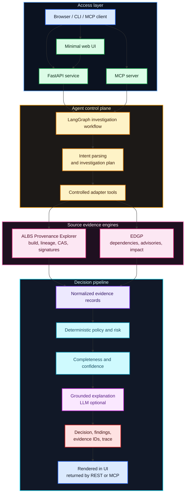
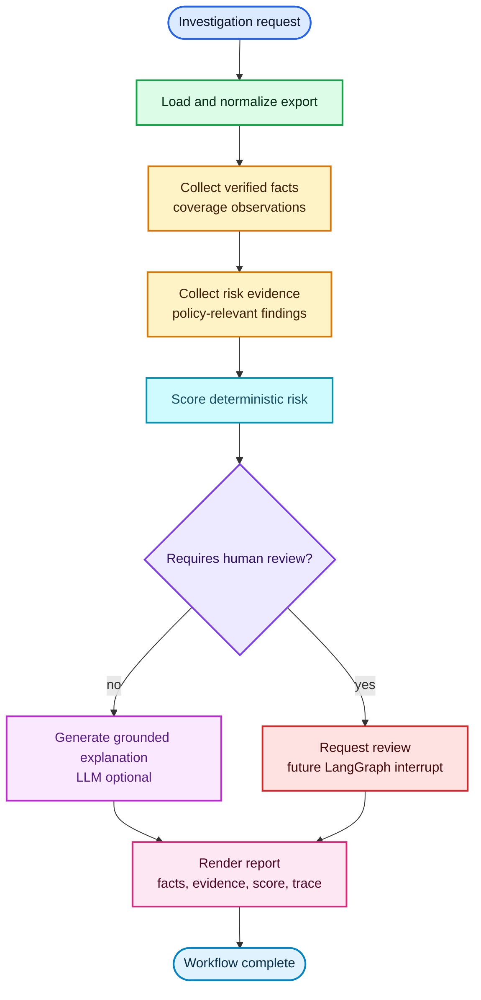

# Enterprise Linux Provenance Risk Agent

Enterprise Linux Provenance Risk Agent is a container-first agentic application
for explainable Enterprise Linux artifact risk analysis.

The project is evolving from a compact LangChain/LangGraph learning harness
into a deployable application with a web UI, REST API, MCP interface, typed
evidence contracts, deterministic policy evaluation, and grounded explanations.

The agent consumes evidence from ALBS Provenance Explorer and Enterprise
Dependency Graph Pipeline (EDGP), gathers deterministic provenance and graph
evidence, calculates deterministic risk and policy outputs, and uses an LLM
only for optional explanation. The LLM never invents or modifies package facts,
evidence records, risk scores, completeness, confidence, or decisions.

## Vision, Scope, and Goal

The project vision is straightforward: Enterprise Linux supply-chain tools
should expose an interface that matches how quickly modern investigations have
to move.
ALBS Provenance Explorer and EDGP already provide strong deterministic
capabilities, but their command-line surfaces have many commands, parameters,
source contracts, and cross-tool combinations. Without an orchestration layer,
the human operator becomes the agent: choosing commands, remembering flags,
translating artifact identities, joining outputs, checking policy implications,
and tracking which evidence supports which conclusion.

This project makes that agentic layer explicit and programmatic. The agentic
behavior lives in bounded workflow orchestration, tool selection, state
management, evidence normalization, missing-evidence detection, contradiction
detection, policy evaluation, and grounded synthesis. An LLM can help interpret
intent and explain results, but it is not the authority for evidence, risk,
completeness, confidence, or admission decisions.

In this architecture, the agent behaves less like a chatbot and more like a
specialized security officer for software supply-chain evidence. It investigates
an artifact, verifies deterministic evidence, applies policy rules, identifies
missing or contradictory facts, and produces a verdict. The verdict is not an
unsupported model opinion: it must be backed by evidence records and rule
results, with enough traceability for a human or downstream system to accept,
review, or reject it.

The policy layer plays the role of the rulebook: evidence is checked against
explicit rules, and every material conclusion must cite the facts that support
it.

The scope is intentionally narrow: the agent sits above ALBS Provenance
Explorer and EDGP, uses them as source engines, and presents their combined
evidence through UI, REST, CLI, and MCP. It is not a generic chatbot and it
does not replace deterministic provenance, graph, vulnerability, or policy
logic. The goal is to give existing tools a faster, safer, inspectable
interface for asking: why is this artifact risky, what evidence supports that
answer, and is there enough evidence to trust the decision?

## New MVP Goal

The MVP goal is a runnable demonstrator where a user can start the application
with:

```bash
docker compose up --build
```

Then open the UI, select a supplied Enterprise Linux artifact, ask why it is
risky, and receive:

- a deterministic risk assessment;
- an explicit decision state;
- evidence completeness;
- confidence assessment;
- grounded explanation with evidence identifiers;
- visible tool and workflow trace;
- evidence integrated from both ALBS Provenance Explorer and EDGP;
- no unsupported claims in the golden evaluation harness.

The first approved planning document is
[`docs/planning/initial-demonstrator-plan.md`](docs/planning/initial-demonstrator-plan.md).

## Why this project

It is deliberately not a generic chatbot.

It demonstrates:

- LangChain tools as typed adapters over provenance data;
- LangChain prompt/model composition for evidence-grounded explanation;
- LangGraph state, nodes, conditional routing and checkpoints;
- separation of deterministic security logic from probabilistic narration;
- a clean future integration boundary for ALBS Provenance Explorer or EDGP.

## Target Architecture



Deterministic code owns evidence retrieval, normalization, policy evaluation,
risk scoring, evidence completeness, confidence, contradictions, and final
decision state. The model may help interpret intent, plan bounded
investigations, and explain already-computed evidence.

## Workflow



A later iteration can replace `request_review` with a LangGraph `interrupt()`
and persist the workflow using SQLite or PostgreSQL checkpoints.

## MVP Roadmap

1. **Contracts and fixture catalog**
   Add Pydantic contracts for artifact identity, evidence records, findings,
   policy results, decisions, completeness, confidence, and tool traces.
2. **Two-engine vertical slice**
   Answer one question for one supplied artifact using ALBS provenance evidence
   and EDGP dependency, advisory, or impact evidence in the same result.
3. **Policy, risk, completeness, confidence**
   Keep risk, evidence completeness, and confidence as separate deterministic
   outputs. Missing evidence must not be reported as proof of safety.
4. **FastAPI service**
   Add health/readiness, example listing, investigation, event, evidence,
   finding, and direct evaluation endpoints.
5. **Minimal web UI**
   Provide a restrained investigation screen for selecting an artifact, asking
   the default question, and viewing evidence, findings, trace, risk,
   completeness, confidence, and decision.
6. **Docker Compose demonstrator**
   Package the app so `docker compose up --build` starts the UI/API/MCP-ready
   service with curated fixtures.
7. **MCP and golden evaluation**
   Expose normalized investigation capabilities through MCP and add golden
   cases for missing signatures, unknown builders, vulnerabilities, incomplete
   provenance, contradictions, timeouts, malformed data, and prompt injection.

## Input contract

The preferred inputs are real exports from the local EDGP and ALBS projects:

- `albs-provenance-explorer/v1`
- `edgp.rpm.albs_provenance.v1`
- `edgp.albs.artifact_inventory.v1`
- `edgp.graph.snapshot.v1`

The small format below is kept only as a learning fixture and compatibility
input:

```json
{
  "artifact": {
    "name": "openssl",
    "version": "3.2.2-6.el10",
    "digest": "sha256:..."
  },
  "build": {
    "builder": "albs",
    "signed": true,
    "reproducible": false,
    "source_commit": "abc123"
  },
  "dependencies": [
    {"name": "glibc", "version": "2.39", "direct": true}
  ],
  "vulnerabilities": [
    {"id": "CVE-2026-0001", "severity": "high", "fixed": false}
  ],
  "policy": {
    "allowed_builders": ["albs"],
    "require_signature": true,
    "require_reproducible": false
  }
}
```

## Run

```bash
python -m venv .venv
. .venv/bin/activate
pip install -e .
provenance-agent analyze examples/suspicious-build.json
```

The default mode is fully local and deterministic.

Programmatic output:

```bash
provenance-agent analyze examples/suspicious-build.json --format json
```

Reports separate verified facts from risk evidence. Verified facts describe
coverage that was present, such as ALBS signature/CAS/release coverage or EDGP
match coverage. Risk evidence is the weighted material that changes the score.

Run against the local ALBS / EDGP project contracts:

```bash
provenance-agent analyze /Users/pawel/_DEV/ALBS-provenance/albs-provenance-explorer/examples/demo-nginx-core/nginx-core-x86_64-trust.json
provenance-agent analyze /Users/pawel/_DEV/SoftwareSupplyChain/tests/fixtures/rpm-albs-provenance.json
provenance-agent analyze /Users/pawel/_DEV/SoftwareSupplyChain/tests/fixtures/albs-artifact-inventory.json
```

To enable LLM narration:

```bash
pip install -e '.[openai]'
export OPENAI_API_KEY=...
provenance-agent analyze examples/suspicious-build.json \
  --model openai:gpt-4.1-mini
```

The model name is intentionally supplied at runtime. The core workflow does not
depend on one provider.

## Questions this agent can answer later

- Why is this RPM considered risky?
- Which evidence caused the score?
- Did the binary come from an approved builder?
- Is its signature missing or invalid?
- Which unresolved CVEs affect the artifact?
- What changed between two builds?
- Should this artifact be admitted, quarantined, or escalated?

## Production extension points

1. Replace the JSON repository with an ALBS/EDGP HTTP or SQLite adapter.
2. Add graph queries: reverse dependencies, blast radius and provenance paths.
3. Add `interrupt()` before quarantine or policy override.
4. Add a persistent checkpointer.
5. Add LangSmith or OpenTelemetry traces.
6. Build a golden evaluation set of known artifacts and expected evidence.
7. Add prompt-injection defenses: treat package metadata as untrusted data.
